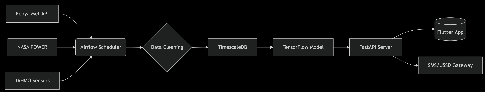
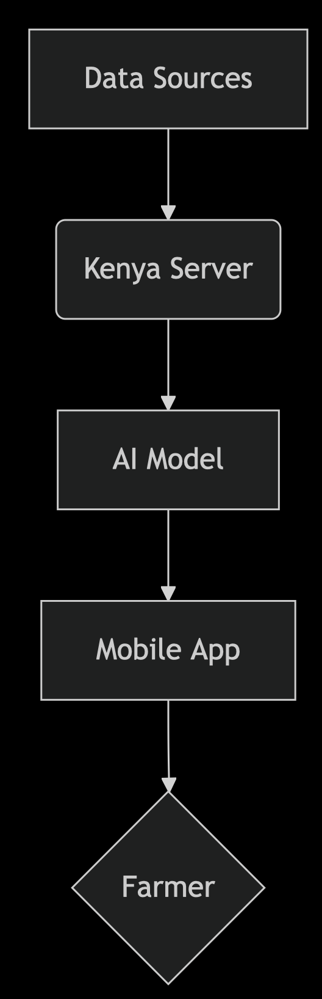

# Kenya Weather Prediction App: Tools, Data & Funding Recommendations  

## **1. Core Tools**  

### **AI/ML Development**  

| Task                  | Recommended Tools                          |
|-----------------------|--------------------------------------------|
| Time-Series Forecasting | TensorFlow, PyTorch Lightning, Facebook Prophet |
| Geospatial Analysis  | Google Earth Engine, ArcGIS Python API     |
| Model Deployment     | TF Serving, ONNX Runtime, AWS SageMaker   |
| Experiment Tracking  | MLflow, Weights & Biases                  |

### **Data Engineering**  

- **Pipelines:** Apache Airflow, Prefect  
- **Storage:** TimescaleDB (PostgreSQL), AWS S3  
- **Processing:** Pandas, Spark (for large datasets)  

### **App Development**  

- **Frontend:** Flutter + Riverpod  
- **Backend:** FastAPI (Python), Firebase  
- **Maps/Visualization:** Mapbox GL JS, Chart.js  
- **CI/CD:** GitHub Actions, Codemagic  

---

## **2. Kenya-Specific Datasets**  

### **Primary Sources**  

| Source                          | Description                                | Access Method               |
|---------------------------------|--------------------------------------------|-----------------------------|
| Kenya Meteorological Department | Official weather records                   | Partnership required        |
| ICPAC                           | East Africa climate forecasts              | [icpac.net](https://icpac.net) |
| NASA POWER                      | Satellite weather data (0.5° resolution)   | Free API                    |
| TAHMO                           | Ground station network                     | [tahmo.org](https://tahmo.org) |

### **Complementary Data**  

- **Agriculture:** Kenya Agricultural Observatory Platform (KAOP)  
- **Topography:** USGS EarthExplorer (DEMs)  
- **Disasters:** EM-DAT Kenya records  

---

## **3. Funding Sources**  

### **Grants & Competitions**  

| Program                         | Focus                     | Funding Range       | Link                                   |
|---------------------------------|---------------------------|---------------------|----------------------------------------|
| Mozilla Africa Innovation Grants | Data projects             | Up to $50,000       | [Mozilla Foundation](https://foundation.mozilla.org) |
| Google AI for Social Good       | AI solutions              | Grants + Cloud credits | [ai.google](https://ai.google/social-good) |
| Kenya Climate Innovation Center | Climate tech              | Varies              | [kenyacic.org](https://www.kenyacic.org) |

### **Local Partnerships**  

- **Safaricom MPESA Innovation Fund**  
- **KCB Foundation Grants**  
- **University of Nairobi AI Lab** (technical collaboration)  

### **Cloud Credits**  

- **AWS Activate:** $1,000–$100,000 in credits  
- **Google for Startups:** $2,000–$100,000  

---

## **4. Cost-Saving Tips**  

✅ **Use open data:** NASA POWER, CHIRPS rainfall data  
✅ **Apply for credits:** AWS/GCP startup programs  
✅ **Collaborate:** Share GPU resources via Zindi Africa  

## **5. Key Actions**  

1. **Immediate:**  
   - Register for ICPAC data access.  
   - Apply for AWS Activate credits.  
2. **First 3 Months:**  
   - Prototype with NASA + TAHMO data.  
   - Submit 1–2 grant applications.  

---

## **Template Attachments**  

- [ ] **Grant Application Template** (See Appendix A)  
- [ ] **Data Sharing Agreement Draft** (For Kenya Met Dept)  
- [ ] **Architecture Diagram** (AWS/GCP setup)  

## **6. Appendices**  

### **Appendix A: Grant Application Template**  

**Project Title:** AI-Powered Weather Forecasting for Kenyan Agriculture  

**Organization Name:** [Your Company]  

**Amount Requested:** $[X]  

**Project Summary:**  
"Develop an AI model using Kenya Met Department data to deliver hyperlocal weather predictions via SMS/USSD, targeting smallholder farmers."  

**Key Sections:**  

1. **Problem Statement**  
   - 80% of Kenyan farmers rely on rain-fed agriculture (cite World Bank).  
   - Current forecasts lack granularity for rural areas.  

2. **Technical Approach**  
   - Data Sources: Kenya Met + TAHMO ground stations  
   - Model: LSTM networks with ICPAC seasonal data  

3. **Impact Metrics**  
   - Target: 50% forecast accuracy improvement in [Region]  
   - Reach: 10,000 farmers in Year 1  

4. **Budget Breakdown**  
   - Data Licensing: $5,000  
   - Cloud Compute: $3,000 (AWS credits cover 50%)  
   - Localization: $2,000 (Swahili/Kikuyu translations)  

**Submission Tips:**  

- Align with SDGs (2, 13)  
- Highlight local partnerships (e.g., University of Nairobi)  
- Focus on rural farmers  
- Use ICPAC seasonal data

### **Appendix B: Kenya Met Department Proposal Outline**

## Email Subject

**Collaboration Request – AI Weather Forecasting Project**  

## Body Template  

**Dear [Director, Kenya Meteorological Department],**  

We’re developing an AI platform to enhance weather accessibility for Kenyan farmers and seek to collaborate with your esteemed institution on:  

1. **Data Sharing:** Historical rainfall/temperature records for [Regions]  
2. **Validation:** Joint evaluation of model accuracy  
3. **Dissemination:** Co-branded alerts via our app  

In return, we offer:  

- Free API access for KMD’s public portal  
- Training workshops on AI/ML for your staff  

Available for a meeting on **[Dates]**.  

**Sincerely,**  
[Your Name]  

## Follow-Up  

- **CC:** Contacts from the University of Nairobi’s Meteorology Dept  
- **Offer:** To sign an NDA/MoU upon mutual agreement  

### **Appendix C: Data Pipeline Architecture Diagram**

## Recommendation: Data Pipeline Architecture

The following diagram illustrates the simplified data pipeline architecture:

**Figure 1:** Data Pipeline Architecture  
   > *Sources: Kenya Met (API), NASA (Satellite), TAHMO (Ground Sensors)*

***A simplified version:***

## Data Pipeline Architecture

Here’s a simplified form of the AI-powered weather app's data pipeline:

**Key Components:**

1. Ingestion: Airflow fetches data daily at 6AM EAT
2. Storage: TimescaleDB for time-series efficiency
3. Serving: Model outputs cached in Redis for low-latency

### **Appendix D: Risk Mitigation Plan for Data Outages**  

| Risk                          | Mitigation Strategy                                                                 | Backup Solution                               |
|-------------------------------|-------------------------------------------------------------------------------------|----------------------------------------------|
| Kenya Met API downtime        | Cache last 30 days of data; use ICPAC satellite data as fallback                    | Manual CSV upload from KMD email reports     |
| Sensor network failure        | Deploy 5 low-cost AWS IoT LoRaWAN gateways in key counties                          | Citizen reports via USSD/SMS                 |
| Cloud provider outage        | Multi-region deployment (AWS Africa + Europe)                                       | Local server at University of Nairobi        |
| Model drift                  | Weekly retraining with new data                                                     | Rule-based fallback (historical averages)    |
| Internet connectivity issues | Offline-first app design; sync when connection resumes                              | Pre-loaded seasonal trends for each county   |

---

### **Appendix E: Farmer Feedback Questionnaire**  

**Objective:** Validate app usability and forecast relevance for smallholder farmers  

**Sample Questions:**  

1. **Current Practices**
   - "How do you currently check weather forecasts? (Radio/SMS/Neighbors/Other)"  
   - "What weather info is most critical for your farming decisions?"  

2. **App Feedback**  
   - "Would you prefer forecasts via SMS, app, or voice call?"  
   - "How many days ahead do you need rainfall predictions?" (Circle: 1/3/7/14)  

3. **Willingness to Pay**  
   - "Would you pay 5 KES/day for flood alerts? (Yes/No/Maybe)"  
   - "What’s your preferred payment method? (MPESA/Airtel Money/Cash)"  

**Implementation Tips:**  

- Conduct interviews in Swahili/Kikuyu  
- Offer 50MB airtime for participation  
- Use KoboToolbox for offline data collection  

---

### **Appendix F: AWS vs GCP Cost Comparison**  

| Service                | AWS (Monthly)          | GCP (Monthly)         | Best for Kenya            |
|------------------------|------------------------|-----------------------|---------------------------|
| VM Instance (4vCPU)    | $70 (t3.xlarge)        | $65 (n2-standard-4)   | **GCP** (cheaper)         |
| Object Storage (100GB) | $2.30 (S3)             | $2.00 (Cloud Storage) | **GCP**                  |
| PostgreSQL Database    | $90 (RDS)              | $77 (Cloud SQL)       | **GCP**                  |
| AI Training (GPU)      | $1.10/hr (p3.2xlarge)  | $0.95/hr (T4)         | **GCP**                  |
| Data Transfer OUT      | $0.09/GB (First 10TB)  | $0.12/GB              | **AWS** (Lower egress)   |
| Local Presence         | AWS Africa (Cape Town) | GCP Johannesburg      | **AWS** (Lower latency)  |

**Key Findings:**  

- **GCP is 15-20% cheaper** for compute/storage  
- **AWS has better Africa network performance**  
- **Hybrid Approach:** Use GCP for model training + AWS for app serving  

---

## **7. Implementation Checklist**  

- [ ] **Risk Mitigation:** Deploy 2 IoT fallback sensors in Nakuru & Kisumu  
- [ ] **Farmer Interviews:** Complete 50+ surveys by [Date]  
- [ ] **Cloud Setup:** Start with GCP free tier ($300 credits)  

## **8. Templates Attached**  

- [X] Risk Mitigation Plan  
- [X] Farmer Questionnaire  
- [X] Cloud Cost Calculator (AWS+GCP)
